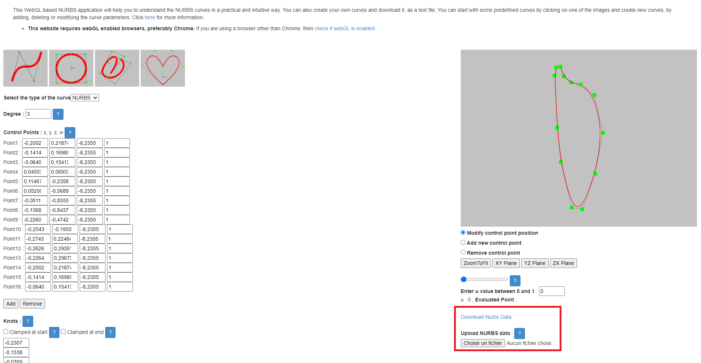

# scripts_bunch
Bunch of scripts that can be useful for anything

## Extract BSpline from step file to print it in Nurbs Calculator

[Nurbs Calculator](http://nurbscalculator.in/) is a tool that allows you to plot a bpsline/bezier/nurbs curve.
The purpose of this script is to extract, for a given identifier, the associated BSpline in a step file.

### How to use this script ?

Find the bspline you're interested by in your step file
<pre>
    <code>
        #348=B_SPLINE_CURVE_WITH_KNOTS('',3,(#508,#509,#510,#511),.UNSPECIFIED.,.F.,.F.,(4,4),(0.,1.),.UNSPECIFIED.);
    </code>
</pre>
Notice the line identifier (#348 in the previous example).

Run the following in bash or powershell:

<pre>
    <code>
        python .\extract_bspline_step_for_nurbs_calculator.py "your_step_file.stp" '#343' > "your_output_txt_file.txt"
    </code>
</pre>

The following screenshot shows you where to load the txt file you generated.

    

